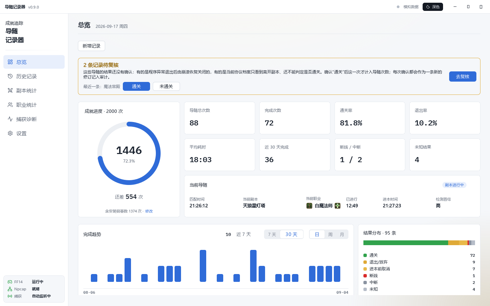
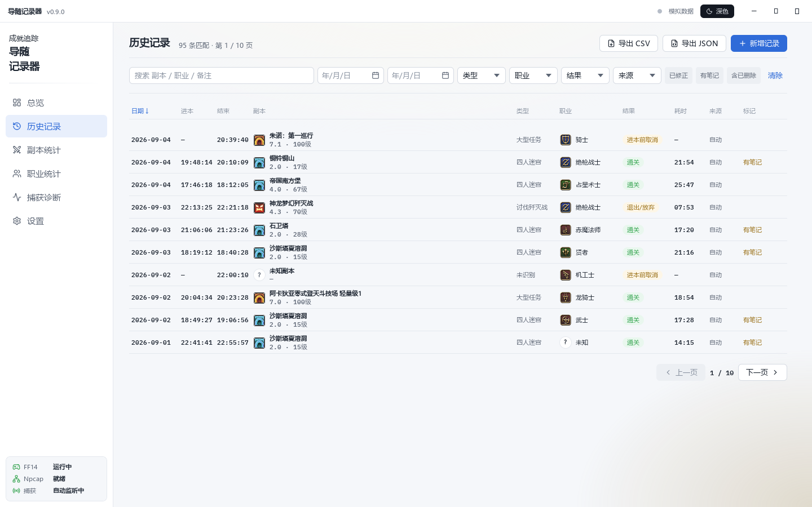

<h1 align="center">
  <br>
  导随记录器
</h1>

<p align="center">自动记录《最终幻想 14》指导者任务的 Windows 桌面应用</p>

<p align="center">
  <a href="https://github.com/Harendotes-Tang/MentorRouletteRecorder/actions/workflows/ci.yml"></a>
  <a href="https://github.com/Harendotes-Tang/MentorRouletteRecorder/releases/latest"></a>
  <a href="LICENSE"></a>
  
</p>

<p align="center">
  <a href="https://github.com/Harendotes-Tang/MentorRouletteRecorder/releases/latest">下载</a> ·
  <a href="#快速开始">快速开始</a> ·
  <a href="#常见问题">常见问题</a> ·
  <a href="#参与贡献">参与贡献</a>
</p>

---

导随记录器以只读方式监听本机网卡上的游戏流量，识别指导者任务（俗称"导随"）的匹配、进入副本、
离开副本三个事件并生成记录，按职业、副本、耗时与结果汇总为历史与统计。不注入、不读内存、不发包、
无遥测；所有数据仅保存在本机。

<p align="center"></p>

> **English summary.** A Windows desktop application that records FINAL FANTASY XIV
> *Duty Roulette: Mentor* runs by passively reading the game's network traffic through Npcap.
> It performs no injection and no memory reading, sends no packets from the capture path, and
> collects no telemetry. Only the background collector accesses the network, for three purposes:
> a read-only download of shared calibrations from a public GitHub repository after a game patch
> (enabled by default, can be disabled in Settings), optional online text-to-speech using the
> user's own Azure or OpenAI-compatible key (disabled by default; only the sentence being announced
> is sent), and a notify-only update check that reads the version number of the latest release at
> most once a day (enabled by default, can be disabled; nothing is downloaded or installed).
> Setting `MR_DISABLE_SHARED_FETCH=1`, `MR_DISABLE_ONLINE_SPEECH=1` and `MR_DISABLE_UPDATE_CHECK=1`
> disables all three.
> Supported client: Chinese server (国服) `2026.08.05`; see
> [protocol-profiles/README.md](protocol-profiles/README.md).

## 目录

- [功能](#功能)
- [系统要求](#系统要求)
- [安装](#安装)
- [快速开始](#快速开始)
- [工作原理](#工作原理)
- [隐私与网络边界](#隐私与网络边界)
- [常见问题](#常见问题)
- [从源码构建](#从源码构建)
- [目录结构](#目录结构)
- [参与贡献](#参与贡献)
- [安全](#安全)
- [许可证](#许可证)
- [致谢](#致谢)
- [免责声明](#免责声明)

## 功能

- **自动记录**：识别导随匹配（任务确认弹窗）、进入副本、离开副本三个事件，生成一条记录。
- **历史与统计**：按副本、职业、职能统计次数与耗时，提供成就进度与完成趋势。
- **补录与更正**：支持手工补录、更正、软删除与撤销。所有修改以追加式修订链保存，历史不会丢失。
- **导出与备份**：支持导出 CSV / JSON；数据库每日自动备份，也可手动备份。
- **语音播报（可选）**：默认使用系统语音，可在设置中更换音色或关闭；也可改用在线语音
  （Microsoft Azure 语音或 OpenAI 兼容接口，需自备密钥，默认关闭）。
- **版本更新后自动适配**：游戏更新后，软件在正常游玩中完成本机校准，或获取其他玩家分享的校准、登录时经本机核实后启用，
  通常无需等待新版本发布。详见[常见问题](#常见问题)。

<details>
<summary>更多截图</summary>
<p align="center"></p>
</details>

**已知限制（1.4.0）：** 尚不能自动判定是否通关。离开副本后，软件弹出「本次导随结果」对话框，
由用户选择「通关」或「未通关」；也可稍后在总览页的「待复核」中确认。通关报文识别完成后，此步骤将不再需要。

## 系统要求

| 项目 | 要求 |
|---|---|
| 操作系统 | 64 位 Windows 10 版本 1809（内部版本 17763）或更新，或 Windows 11。ARM 设备只支持 Windows 11（x64 模拟，抓包未验证）。Windows “N” 版本需安装媒体功能包才能语音播报。安装程序会检查这些条件 |
| 游戏客户端 | 《最终幻想 14》国服客户端；已验证版本见[工作原理](#工作原理) |
| 抓包驱动 | [Npcap](https://npcap.com/)（安装程序会引导安装，需启用 *WinPcap API-compatible Mode*） |
| 运行库 | 无需另行安装，安装包已包含 .NET 与 Qt 运行时 |

## 安装

从 [Releases](https://github.com/Harendotes-Tang/MentorRouletteRecorder/releases) 下载
`MentorRecorder-<版本>-setup.exe` 并运行。

- 默认安装目录为 `D:\MentorRecorder`，可在安装时更改。
- 若系统未安装 Npcap，安装程序将从 npcap.com 下载并启动其官方安装程序（Npcap 的免费许可证
  不允许随本软件再分发）。安装 Npcap 时请保留默认选项，尤其是 *WinPcap API-compatible Mode*。

另提供 zip 包，解压后可直接运行，同样包含运行时。

## 快速开始

1. **先启动本软件，再启动游戏。** 游戏启动后软件自动开始监听，登录前无需任何操作。
2. 若游戏已处于登录状态，请退回标题画面后重新登录，无需退出游戏。国服客户端登录后始终复用同一条连接，
   而流量解压必须从连接建立时开始跟踪，因此传送不能代替重新登录。
3. 正常参加指导者任务。任务结束后，在「待复核」中确认结果。

**游戏程序副本。** 为解压游戏流量，软件会将游戏可执行文件复制到临时目录，并在自身进程中加载该副本；
软件不读取游戏进程的内存。副本在停止监听时删除；因文件被占用或软件被强制结束而未能删除的副本
会登记在清单中，于下次启动时删除。运行 `MentorRecorder.Collector.exe --capture-doctor`，
可在"游戏程序临时副本"一节查看剩余副本。首次运行时的说明页也会列出此项。

## 工作原理

本软件由两个进程组成，二者仅通过命名管道通信：

| 进程 | 技术 | 职责 |
|---|---|---|
| `MentorRecorder.Collector.exe` | C# / .NET 8，Machina.FFXIV + Npcap | 抓包、解码、协议解析、状态机；SQLite 的唯一写入者；命名管道服务端 |
| `MentorRecorder.Desktop.exe` | C++20 / Qt 6 Quick | 界面；命名管道客户端；启动并监控 Collector |

协议常量不写入代码，而是存放在可审计的**协议档案**（`protocol-profiles/`）中，每个常量均注明证据来源；
档案与客户端版本不匹配时停止记录，不写入可能错误的数据。

| 区服 | 客户端版本 | 状态 |
|---|---|---|
| 国服 | `2026.08.05` | `VERIFIED`：已识别任务确认弹窗与区域切换两类消息；通关报文尚未识别 |
| 国服 | 之后的版本 | 通过本机校准或共享校准适配，见[常见问题](#常见问题) |
| 国际服 | — | 不支持：无经验证的协议档案，软件不解析、不记录 |

详见 [docs/architecture.md](docs/architecture.md)、[docs/state-machine.md](docs/state-machine.md)、
[docs/protocol-profile-format.md](docs/protocol-profile-format.md)。

## 隐私与网络边界

- 不注入进程，不读取游戏内存，不安装钩子，抓包过程不发送任何数据包，不提供任何自动化操作。
- 无遥测、无账号，不自动下载、不自动安装更新，不上传任何数据。进程间仅通过本机命名管道通信，不监听网络端口。
- 界面进程不发起网络请求。后台采集服务仅在以下三种情况下联网：
  - **共享校准获取**（默认开启）：游戏更新后本机无可用协议档案时，从固定的公开 GitHub 仓库只读下载
    其他玩家分享的校准，经本机流量核实后方可用于记录。正在使用的档案来自共享校准、或按排本推断匹配时，
    也会按同样的节流读取一次索引，以便及时得知该校准码被撤回或出现了更准的码；请求内容完全相同，
    同样不上传任何内容。可在"设置 → 通用"中关闭
    「游戏更新后获取其他玩家的共享校准」。请求内容与限制见[隐私边界](docs/privacy-boundary.md) §8.2。
  - **在线语音合成**（默认关闭）：仅当用户在"设置 → 播报"中选择在线语音并填写密钥后启用，
    播报时只将当前这句播报文本发送至所选语音服务。密钥仅保存在本机，并由 Windows 加密。
    详见[隐私边界](docs/privacy-boundary.md) §8.3。
  - **检查新版本**（默认开启）：每次启动检查一次，之后每 24 小时最多一次，也可在"设置 → 通用 → 更新"中点「检查更新」；
    只读取发布页上的版本号文件，与当前版本比较，发现新版本时在总览页提示一句，由用户自行在浏览器中下载。
    本软件不下载安装包，也不自动安装。可在同一处关闭「检查新版本并提示」。详见[隐私边界](docs/privacy-boundary.md) §8.4。
- 如需禁止一切出站请求，将系统环境变量 `MR_DISABLE_SHARED_FETCH`、`MR_DISABLE_ONLINE_SPEECH`
  与 `MR_DISABLE_UPDATE_CHECK` 设为 `1` 后重启软件。
- 不长期保存原始报文。
- 不内置、不分发 Npcap，不分发任何游戏客户端文件。

完整清单及自行验证方法（`netstat`、Process Explorer、数据目录内容）见
[docs/privacy-boundary.md](docs/privacy-boundary.md)。

## 常见问题

**需要以管理员身份运行吗？**
通常不需要。若安装 Npcap 时勾选了"仅限管理员使用"（*Restrict Npcap driver's access to Administrators only*），
则需以管理员身份运行本软件，或重新安装 Npcap 并取消该选项。

**游戏更新后还能用吗？**
可以。更新后首次运行时，软件会提示"正在重新校准"：正常完成一次随机任务（不限于指导者任务）后，
逐项核对校准结果并启用，随后恢复自动记录。若已有其他玩家分享了该版本的校准，软件会先获取，登录时在本机流量中核实通过就启用，
第一把随机任务即可正常记录与播报；排本与进本报文在记录中继续核实，对不上会自动改回本机校准并把期间的记录标记待复核。
只有报文结构发生变化时，才需要将证据提交给维护者。详见
[docs/live-validation-guide.md](docs/live-validation-guide.md) §7.6。

**支持国际服吗？**
不支持。国际服没有经过验证的协议档案，软件对其不解析、不记录。协议档案的证据要求见
[protocol-profiles/global/README.md](protocol-profiles/global/README.md)。

**使用加速器或 VPN 时能正常记录吗？**
游戏流量可能不经过软件所监听的网卡。请到"捕获诊断"页重新选择网卡；仍无法读取时，关闭加速器后重启本软件。

**数据保存在哪里？**
`%LOCALAPPDATA%\MentorRecorder\`（或环境变量 `MR_DATA_DIR` 指定的目录）。记录保存在 `mentor_recorder.db`，
每日自动备份位于 `backups\`，保留最近 14 份。该目录下每个文件的用途见
[docs/privacy-boundary.md](docs/privacy-boundary.md) §9。

**为什么已登录时必须重新登录？**
国服客户端登录后始终复用同一条连接，而流量解压必须从连接建立时开始跟踪。退回标题画面重新登录，无需退出游戏。

## 从源码构建

依赖：.NET 8 SDK、Qt 6.11.2（MinGW 13）、CMake ≥ 3.24、Ninja、PowerShell 7。
工具链路径由环境变量 `MR_QT_PREFIX`、`MR_MINGW_BIN`、`MR_NINJA_EXE`、`MR_CMAKE_EXE` 指定；
未设置时使用 [docs/build-and-package.md](docs/build-and-package.md) 中的示例路径。

```powershell
pwsh -File scripts/bootstrap.ps1     # 检查工具链（不下载任何内容）
pwsh -File scripts/build.ps1         # 构建 Collector 与 Desktop
pwsh -File scripts/test.ps1          # .NET 测试 + Qt 测试
pwsh -File scripts/verify.ps1        # 静态边界检查 + 全部测试
pwsh -File scripts/package.ps1 -Verify   # 生成 zip 与安装器（需要 Inno Setup 6）
```

Collector 的命令行参数（`--serve`、`--replay`、`--validate-profile`、`--capture-doctor` 等）及
Desktop 的截图与模拟参数见 [docs/build-and-package.md](docs/build-and-package.md)。

## 目录结构

```
src/Collector/          C# Collector（抓包、协议、状态机、存储、IPC、导出）
src/Desktop/            C++20 Qt 6 Quick 桌面端（cpp/ qml/ resources/）
contracts/              IPC 契约：JSON Schema、错误码、变更记录
protocol-profiles/      协议档案（cn/ 正式与候选档案，global/ 占位，synthetic/ 离线测试）
data/duties/ data/jobs/ 副本与职业名称映射（仅用于显示）
migrations/             SQLite 迁移
installer/              Inno Setup 安装器脚本
scripts/                环境检查、构建、测试、验证、打包
tests/                  .NET 单元/集成测试、Qt 桌面测试、离线固件
tools/                  档案校验器、固件重放、数据生成器、静态边界检查
docs/                   设计与验证文档
```

## 参与贡献

欢迎提交 issue 与 Pull Request，提交前请阅读 [CONTRIBUTING.md](CONTRIBUTING.md)。
协议档案仅接受有证据支持的常量（本机流量观察、公开文档或用户核对），来源不明的 opcode 表不予接受。

## 安全

请勿通过公开 issue 报告安全问题。报告方式见 [SECURITY.md](SECURITY.md)。

## 许可证

本项目以 **GPL-3.0-or-later** 发布（[LICENSE](LICENSE)）。由于链接了 GPL-3.0 许可的 Machina.FFXIV
与 GPL-3.0-only 许可的 Qt Graphs，本项目不得以闭源形式分发。

## 致谢

- [Machina.FFXIV](https://github.com/ravahn/machina)（GPL-3.0）：游戏流量的捕获与解码。
- [Npcap](https://npcap.com/)：抓包驱动；不随本软件分发，由安装程序引导用户自行安装。
- [Qt 6](https://www.qt.io/)（GPL-3.0）：桌面界面。
- [Lucide](https://lucide.dev/)（ISC）：界面图标。
- 职业、职能、副本类型图标以及副本、职业名称为 SQUARE ENIX 的游戏素材，依据
  [FINAL FANTASY XIV Materials Usage License](https://support.na.square-enix.com/rule.php?id=5382&tag=authc)
  以非商业用途随本软件分发；来源与版权声明见"设置 → 关于 → 版权与来源"。如需使用自行提取的图标，
  将其放入 `%LOCALAPPDATA%\MentorRecorder\icons\`，软件将优先读取；目录结构见
  [src/Desktop/resources/icons/LICENSE-NOTE.md](src/Desktop/resources/icons/LICENSE-NOTE.md)。

完整的第三方组件与许可证清单见 [THIRD_PARTY_NOTICES.md](THIRD_PARTY_NOTICES.md)。

## 免责声明

FINAL FANTASY XIV 是 SQUARE ENIX CO., LTD. 的商标。本项目与 SQUARE ENIX 无任何关联，亦未获其授权、
认可或赞助。本软件不修改游戏、不注入、不提供自动化功能，但不对账号安全作任何保证，用户应自行判断
是否使用并承担相应风险。抓包会读取本机网卡流量，请确认所在网络环境允许此类操作。
