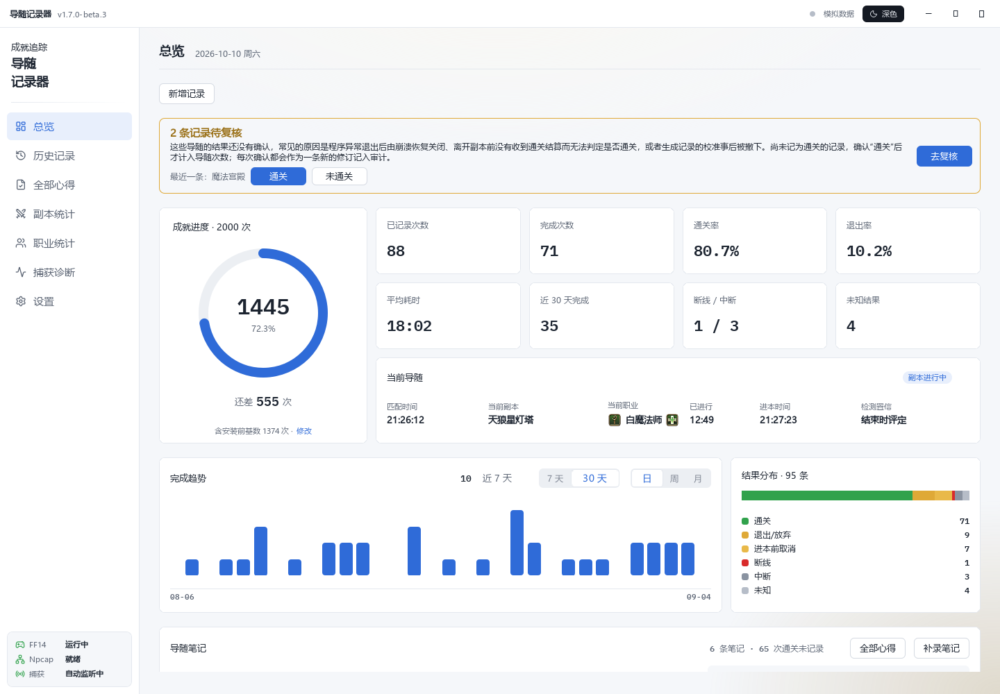
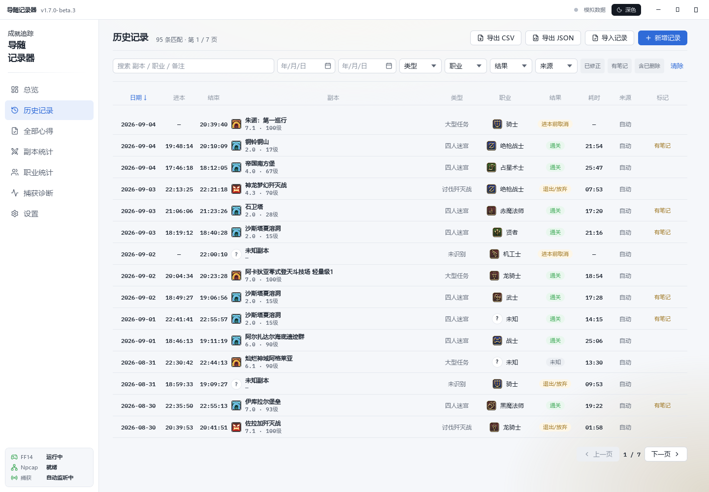
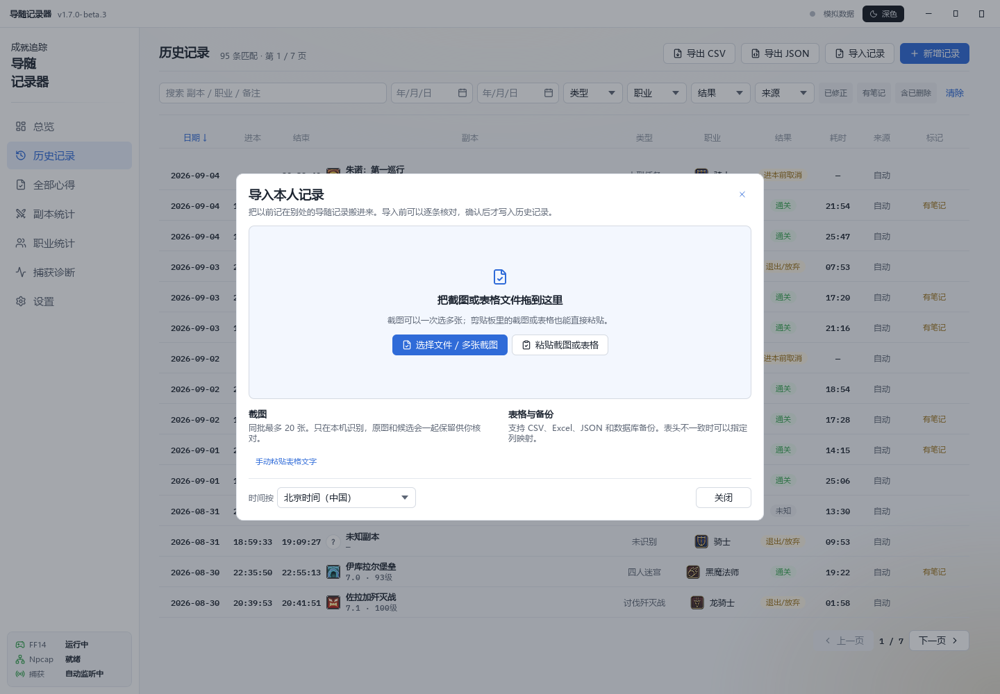
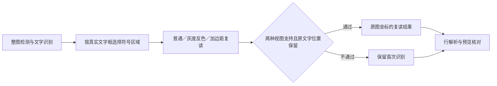

<h1 align="center">
  <br>
  导随记录器
</h1>

<p align="center">自动记录《最终幻想 14》指导者任务的 Windows 桌面应用</p>

<p align="center">
  <a href="https://github.com/Harendotes-Tang/MentorRouletteRecorder/actions/workflows/ci.yml"></a>
  <a href="https://github.com/Harendotes-Tang/MentorRouletteRecorder/releases/latest"></a>
  <a href="LICENSE"></a>
  
</p>

<p align="center">
  <a href="https://github.com/Harendotes-Tang/MentorRouletteRecorder/releases/latest">正式版下载</a> ·
  <a href="https://github.com/Harendotes-Tang/MentorRouletteRecorder/releases">测试版与历史版本</a> ·
  <a href="#快速开始">快速开始</a> ·
  <a href="#常见问题">常见问题</a> ·
  <a href="#参与贡献">参与贡献</a>
</p>

---

导随记录器以只读方式监听本机网卡上的游戏流量，识别指导者任务（俗称"导随"）的匹配、进入副本、
离开副本三个事件并生成记录，按职业、副本、耗时与结果汇总为历史与统计。不注入、不读内存、不发包、
无遥测；所有数据仅保存在本机。

**当前源码版本：** `1.7.0-beta.3`（测试版，版本来源为 [Directory.Build.props](Directory.Build.props)）。
下文包含该测试版的记录导入、离线截图识别与心得库功能；正式版与测试版的区别见[安装](#安装)，
本轮变更见 [CHANGELOG.md](CHANGELOG.md)。

<p align="center"></p>

> **English summary.** A Windows desktop application that records FINAL FANTASY XIV
> *Duty Roulette: Mentor* runs by passively reading the game's network traffic through Npcap.
> It performs no injection and no memory reading, sends no packets from the capture path, and
> collects no telemetry. Only the background collector accesses the network, for three purposes:
> a read-only download of shared calibrations from a public GitHub repository after a game patch
> (enabled by default, can be disabled in Settings), optional online text-to-speech using the
> user's own Azure or OpenAI-compatible key (disabled by default; only the sentence being announced
> is sent), and an update check that reads the version number of the latest release at most once a
> day (enabled by default, can be disabled). The installer of a newer version is downloaded only
> when the user clicks 「下载并安装」, kept only if it matches the SHA-256 published beside it, and
> started only when the user clicks 「立即安装」; nothing is downloaded or installed automatically.
> Setting `MR_DISABLE_SHARED_FETCH=1`, `MR_DISABLE_ONLINE_SPEECH=1` and `MR_DISABLE_UPDATE_CHECK=1`
> disables all three.
> The current source version is `1.7.0-beta.3`. It also supports local record imports from CSV,
> XLSX, native JSON, database backups, pasted tables and screenshots. Screenshot OCR runs offline;
> imports require preview and confirmation, and conflicts preserve local records. Reflection sharing
> saves a PNG locally without uploading it.
> Supported client: Chinese server (国服) `2026.08.05`; see
> [protocol-profiles/README.md](protocol-profiles/README.md).

## 目录

- [功能](#功能)
- [系统要求](#系统要求)
- [安装](#安装)
- [快速开始](#快速开始)
- [导入历史记录与心得](#导入历史记录与心得)
- [离线截图 OCR](#离线截图-ocr)
- [工作原理](#工作原理)
- [隐私与网络边界](#隐私与网络边界)
- [常见问题](#常见问题)
- [从源码构建](#从源码构建)
- [目录结构](#目录结构)
- [参与贡献](#参与贡献)
- [安全](#安全)
- [许可证](#许可证)
- [致谢](#致谢)
- [免责声明](#免责声明)

## 功能

- **自动记录**：识别导随匹配（任务确认弹窗）、进入副本、离开副本三个事件，生成一条记录；
  副本内收到通关结算时自动记为通关。
- **历史与统计**：按副本、职业、职能统计次数与耗时，提供成就进度与完成趋势。
- **补录与更正**：支持手工补录、更正、软删除与撤销。所有修改以追加式修订链保存，历史不会丢失。
- **记录导入**：支持 CSV、XLSX、原生 JSON、软件数据库备份、粘贴表格与截图。先预览、核对并勾选记录，
  再确认导入；重复记录跳过，冲突保留本地。已计入成就基数的历史通关可在导入时从基数中扣除。
- **离线截图识别**：支持 dlog 手机卡片与网页记录列表，使用随包 OCR 在本机识别，
  可对照原图修改副本、职业、时间、结果与心得；缺失的实际游戏时间保留未知。
  架构、同图测试对比及资源占用见[离线截图 OCR](#离线截图-ocr)。
- **心得库与分享图片**：按副本、职业与记录备注搜索心得，查看记录图片附件，
  预览并保存包含完整心得的 PNG 分享图片，文件留在本机。
- **导出与备份**：支持导出 CSV / JSON；数据库每日自动备份，也可手动备份。
- **语音播报（可选）**：默认使用系统语音，可在设置中更换音色或关闭；也可改用在线语音
  （Microsoft Azure 语音或 OpenAI 兼容接口，需自备密钥，默认关闭）。
- **版本更新后自动适配**：游戏更新后，软件在正常游玩中完成本机校准，或获取其他玩家分享的校准、经本机流量核实后启用，
  通常无需等待新版本发布。详见[常见问题](#常见问题)。

<details>
<summary>更多截图</summary>
<p align="center"></p>
<p align="center"></p>
</details>

**已知限制：** 副本内收到通关结算时，软件自动记为通关并计入进度。该结算目前只在一种副本的一局通关中实测过，
其他类型的副本、中途退出、灭团与超时尚未观测。软件只在收到结算时记为通关，从不因没有收到结算而记为未通关：
离开副本前没有收到结算时，软件弹出「本次导随结果」对话框，由用户选择「通关」或「未通关」；
也可稍后在总览页的「待复核」中确认。

## 系统要求

| 项目 | 要求 |
|---|---|
| 操作系统 | 64 位 Windows 10 版本 1809（内部版本 17763）或更新，或 Windows 11。ARM 设备只支持 Windows 11（x64 模拟，抓包未验证）。Windows “N” 版本需安装媒体功能包才能语音播报。安装程序会检查这些条件 |
| 游戏客户端 | 《最终幻想 14》国服客户端；已验证版本见[工作原理](#工作原理) |
| 抓包驱动 | [Npcap](https://npcap.com/)（安装程序会引导安装，需启用 *WinPcap API-compatible Mode*） |
| 运行库 | 无需另行安装，安装包已包含 .NET 与 Qt 运行时 |

## 安装

- **正式版**：从 [最新正式版](https://github.com/Harendotes-Tang/MentorRouletteRecorder/releases/latest) 下载。
- **测试版**：从 [Releases](https://github.com/Harendotes-Tang/MentorRouletteRecorder/releases) 中选择标为
  **Pre-release**、版本号带 `-beta.N` 的版本。软件内更新检查只提供正式版，测试版需自行下载。

下载所选版本的 `MentorRecorder-<版本>-setup.exe` 并运行。发布页同时提供 `.sha256` 校验文件，
可使用 PowerShell 的 `Get-FileHash -Algorithm SHA256` 核对下载文件。

- 默认安装目录为 `D:\MentorRecorder`（D 盘不是本地固定磁盘或空间不足时为 `Program Files\MentorRecorder`），
  可在安装时更改。所选文件夹须为新建或空的文件夹，或此前安装本软件的文件夹；安装程序会将其设为只有管理员
  可以修改、其他用户只能读取和运行，只有其中存放备注图片的 `note-images` 文件夹允许所有用户写入。
- 若系统未安装 Npcap，安装程序将从 npcap.com 下载并启动其官方安装程序（Npcap 的免费许可证
  不允许随本软件再分发）。安装 Npcap 时请保留默认选项，尤其是 *WinPcap API-compatible Mode*。

另提供 zip 包，解压后可直接运行，同样包含运行时。

## 快速开始

1. 首次启动时，按引导填写游戏成就面板显示的**安装前已完成次数**，或选择稍后填写。
   软件已有计入进度的通关时，应先从面板完成数中减去这些次数，再填入基数；进度等于基数加上软件记录中计入进度的通关次数。
2. **先启动本软件，再启动游戏。** 游戏启动后软件自动开始监听，登录前无需任何操作。
3. 若游戏已处于登录状态，请退回标题画面后重新登录，无需退出游戏。国服客户端登录后始终复用同一条连接，
   而流量解压必须从连接建立时开始跟踪，因此传送不能代替重新登录。
4. 正常参加指导者任务。副本内收到通关结算时自动记为通关；没有收到时，离开副本后确认结果，
   也可稍后在「待复核」中确认。
5. 以前的记录可从「历史 → 导入记录」搬入；心得可在记录中补录，并在「全部心得」查看或生成分享图片。

**游戏程序副本。** 为解压游戏流量，软件会将游戏可执行文件复制到临时目录，并在自身进程中加载该副本；
软件不读取游戏进程的内存。副本在停止监听时删除；因文件被占用或软件被强制结束而未能删除的副本
会登记在清单中，于下次启动时删除。运行 `MentorRecorder.Collector.exe --capture-doctor`，
可在"游戏程序临时副本"一节查看剩余副本。"设置 → 关于"中「查看软件说明」打开的说明同样列出此项。

## 导入历史记录与心得

在「历史」页点击「导入记录」，选择文件、拖入文件，或粘贴剪贴板中的表格与截图。

| 来源 | 支持范围 |
|---|---|
| 表格 | CSV、Excel `.xlsx`、粘贴的表格文字；表头不一致时可指定列映射 |
| 本软件记录 | 本软件导出的原生 JSON、独立的 SQLite 数据库备份；只读解析来源文件，不覆盖当前数据库 |
| 截图 | PNG、JPG / JPEG、WebP、BMP；同批最多 20 张，支持 dlog 手机卡片与网页记录列表 |

1. **预览并修正。** 对照原文件或原图核对副本、职业、结果与心得，按来源选择时间地区。
   来源没有提供结果时会按「通关」预填，应逐条核对；职业图标与副本名称的待确认候选也需核对。
2. **勾选要保存的记录。** 可筛选与批量设置，并勾选「我确认这些是自己的记录」。
   「可能重复」的记录由用户核对后选择。
3. **核对成就基数。** 勾选的记录中有计入进度的通关、且已保存基数大于 0 时，界面会询问这些通关是否已包含在基数中。
   选「已包含」会在保存记录的同时，从基数中扣除实际新增且计入进度的通关数，最低扣到 0，并留下修改记录；
   超过基数的部分仍增加进度。选「未包含」则照常加在基数之上。
   表格、粘贴与截图默认「已包含」，数据库备份与原生 JSON 默认「未包含」，应按实际情况选择。
4. **确认导入。** 点击「导入选中的 N 条」，核对保存结果与基数调整提示；重复记录跳过，冲突记录保留本地。

**原站记录时间不等于实际游戏时间。** 缺少必要的实际游戏时间（例如通关记录的进入或结束时间）时，
记录保留为待补充历史，不计入统计与成就；之后可以继续补充已知信息，也可以只修改备注、心得或附图。
不要为了计入进度而补造未知时间。导入记录尚待复核或未确认属于导随时，也不会计入完成与成就进度。

截图与识别正文只在本机处理。到「全部心得」点击「生成分享图片」，检查包含副本、职业与完整心得的预览后，
选择「保存 PNG 图片」；软件只保存本地文件，分享由用户自行完成。备注图片的保存与备份范围见
[数据保存在哪里](#常见问题)。

## 离线截图 OCR

当前源码采用**本地文字 OCR + 小型职业图标分类器 + 预览修正**。文字识别与图标识别分别处理，
截图、识别正文与模型均在本机使用；用户运行时无需安装 Python，也无需 GPU。
下面的结果来自 2026-10-10 的本地构建和测试；1.7.0-beta.3 包含此架构，实际安装升级与跨机器效果仍需验证。

### 架构与识别流程


可下载[交互架构图](docs/ocr/local-ocr.html)后在本地浏览器打开；图的编辑源为
[local-ocr.architecture.json](docs/ocr/local-ocr.architecture.json)。图中箭头表示数据流，
职业分类器由解析器在桌面进程内调用，文字 OCR 才是单独启动的子进程。

1. **本地文字识别。** `OfflineOcrEngine` 管理临时 PNG，并异步启动随包的 `local-ai-ocr.exe`。
   RapidOCR 3.10.0 / ONNX Runtime 1.31.0 使用 CPU 和固定的本地模型，输出带原图坐标的文字框。
   对深色记录卡片中的符号片段做限量局部复读，保留原有文字与符号位置；不根据句意补齐颜文字。
   识别结束后子进程退出；取消或超时会终止子进程并清理本次临时文件。
2. **按行解析。** `ScreenshotImportParser` 结合文字框、原图与行布局，提取副本、原站记录时间和心得，
   并裁剪职业图标；副本目录可以辅助预填名称，候选仍需核对。
3. **职业分类。** `JobIconClassifier` 在 C++ 中运行小模型，范围与现有可选职业一致：
   21 个战斗职业加「未知」类。训练使用现有图标及不同尺寸、背景、阴影、模糊和压缩的合成样本。
   分数低、候选差距小或形状偏离训练分布时保留未知、提示核对；只有模型不可用时才使用旧模板匹配。
4. **预览与确认。** 界面对照原图展示候选，允许修改与勾选；经本机命名管道交给 Collector 校验、查重和处理冲突。
   用户确认后才由 Collector 写入 SQLite。来源时间仍不代表实际游戏时间，缺失信息保留待补充。

| 环节 | 旧 Tesseract 方案 | 当前本地 AI 方案 |
|---|---|---|
| 文字 | Tesseract 5.4.0.20240606 + 中英文 `tessdata_fast`；裁剪、放大、反色后多次识别 | 固定本地检测、方向分类、文字识别模型；整图检测、限量符号区域复读，再按原图坐标解析 |
| 职业图标 | 图形模板相似度匹配 | 独立小型分类器，保留未知与拒绝门槛；模型不可用时回退模板 |
| 保存 | 预览、修正、勾选、确认导入 | 同样保留人工核对；重复跳过、冲突保留本地 |

### 同图测试对比（2026-10-10）

测试使用用户提供的 **5 张网页列表截图，每张 10 条，共 50 条，覆盖 13 种职业**，逐行对照原图。
旧方案运行保留的测试程序，已经包含此前的网页分行与中文心得修复；新方案运行固定 OCR 与分类器，
并检查 Collector 返回的预览。输入、程序、模型和报告的 SHA256、逐图计数与指标定义保存在
[测试对比证据](docs/ocr-test-comparison-20261010.json)。私人原图不随仓库分发。

最早的用户导入界面只显示 **5/10 条**，这是当时的截图观察。下表的旧方案是修复后的保留测试程序，
不能把它的结果与当时界面观察混为同一次运行。

| 同一批 50 条记录的指标 | 修复后的旧方案 | 当前新架构 |
|---|---:|---:|
| 输出记录数（含字段缺失的候选） | 40/50 | 50/50 |
| 输出且副本名非空 | 34/50 | 50/50 |
| 原始 OCR 副本名逐字一致 | 24/50 | 48/50 |
| 经副本目录辅助后，预览名称一致 | 33/50 | 50/50 |
| 原站日期与时间完整一致 | 33/50 | 50/50 |
| 通过各自识别门槛且职业正确 | 2/50 | 50/50 |
| 非空心得提取到文字（不表示全文正确） | 28/42 | 42/42 |
| 原本空心得有输出且保持空白 | 6/8 | 8/8 |

| 截图 | 尺寸 | 原图条数 | 旧方案输出 | 新架构输出 |
|---|---|---:|---:|---:|
| 最初的学者列表 | 1851 × 1082 | 10 | 10 | 10 |
| 新增图 1 | 1280 × 688 | 10 | 3 | 10 |
| 新增图 2 | 1871 × 1001 | 10 | 9 | 10 |
| 新增图 3 | 1874 × 994 | 10 | 10 | 10 |
| 新增图 4 | 1866 × 1001 | 10 | 8 | 10 |

例如原图的 `啵啵030!`，旧方案读成 `踊听0301!`，新方案读回 `啵啵030!`。
新方案仍有误差：`回家了.jpg 这` 被读成 `回家了.jpg t这`，部分颜文字也有缺失。
原始副本名剩余两处差异为「黃 / 黄」及全角 / 半角感叹号；目录辅助预填成功不等于原始 OCR 全对。

**测试边界：** 此次没有统计心得的逐字准确率，也没有形成同条件的速度对比；旧测试包含裁剪 PNG 的生成，
新报告包含 Collector 预览，部分执行并行，不能据此计算提速倍数。后四张原图未参与分类器训练或门槛选择，
但用于修正图标裁剪，因此最终解析器结果不属于完全未见样本测试。
50/50 仅覆盖这批图片；其余职业的真实截图、其他主题、缩放、低清晰度及未知图标仍需验证。
分类器分数也不等于经过校准的正确率，所有候选仍需预览确认。

### 标点与颜文字复测（2026-10-10）

首次新架构同图对比使用整图 OCR（helper 1）。之后用用户追加的 **2 张截图、20 条记录**增强符号识别，
并以此前 5 张图、50 条作为回归；最终 helper 2 的实际程序 → Qt 解析 → 隔离 Collector 预览共输出 **70/70 条**，
副本目录辅助名称、来源时间与可靠职业候选均逐条核对一致，8 条原本空心得仍保持空白。
这批清晰截图覆盖 21 种可选战斗职业，但不证明其他主题、缩放或模糊截图的准确率。


```mermaid
flowchart LR
    A[整图检测与文字识别] --> B[按真实文字框选择符号区域]
    B --> C[普通／灰度反色／加边距复读]
    C --> D{两种视图支持且原文字位置保留}
    D -->|通过| E[原图坐标的复读结果]
    D -->|不通过| F[保留首次识别]
    E --> G[行解析与预览核对]
    F --> G
```

局部复读使用同一文字模型，最多 48 个区域；已检测的相邻字段、上下行及倾斜框都限制裁剪范围。
前导空心圆点还要有原图中实际闭环、排列和间距证据，并得到两种复读视图的圆点支持；按像素确定个数，
不把完整数字 `0` 或实心点转换成空心标点。文字框相邻的 `030`、`thx` 不再被额外插空格；
完整日期与时刻拆成紧邻框时仍保留结构分隔。已定位删除按钮后，旁边的正文 `x/X/×/✕` 不会随按钮被删掉。

| 两张追加截图的重点项 | 首次 OCR | helper 2 预览 | 结论 |
|---|---|---|---|
| 图 1，第 9、10 条前导四个空心圆点 | 全部遗漏 | 两条均保留 `。。。。` | 找回原图中的圆点 |
| 图 2，第 9 条颜文字尾部 | `(;` | `(; '~)` | 找回部分尾部，仍非完整原文 |
| 图 2，第 10 条颜文字 | `(●∀•)` | `(●∀●)` | 两侧实心圆恢复，重音符号仍漏读 |
| 图 2，第 8 条两处横线、第 4 条两块之间空格 | 遗漏 | 仍遗漏 | 保留为人工修正项 |

连续问号、`030`、`.jpg` 和英文片段已在回归中覆盖。第一张第 3 条换行保留，
但颜文字中的 `ェ`、第 5 条的 `Д` 及部分细线仍未读全；以前已读成 `ooo` 的前缀也没有被盲改或重复追加圆点。
本次不统计心得逐字准确率，不把部分恢复计为颜文字全对。完整计数、程序哈希与限制见
[标点复测证据](docs/ocr-punctuation-test-20261010.json)。原图仍只在本机使用，所有记录保持待核对，未自动勾选或写入历史。

### 本机资源占用与训练

在 Windows x64、Intel Core Ultra 9 275HX 上，以下是首次整图 OCR（helper 1）对最初的 1851 × 1082 截图的测量：

| 项目 | 本次测量 / 产物大小 | 范围 |
|---|---:|---|
| 完整文字 OCR 运行目录 | 249.04 MiB，220 个文件 | 含随包运行时、3 个模型、许可证及部署清单副本；不含 Qt、Collector、训练环境 |
| 3 个文字模型合计 | 30.28 MiB | 已包含在上述运行目录中 |
| 职业分类器模型 | 254.64 KiB | 约 1.8 万个网络参数，C++ 推理 |
| 单张文字 OCR 耗时 | 3.67 秒 | 含子进程启动，不含 Collector 预览 |
| OCR 子进程峰值物理内存 | 402.68 MiB | 单次识别；识别后子进程退出，不是整个应用的内存占用 |
| OCR 子进程峰值提交内存 | 410.89 MiB | 与物理内存是不同口径，不能相加 |
| 职业分类器训练 | 15.45 秒，CPU | 含合成样本生成、训练与门槛选择；正常使用时不训练 |

此规模的分类器在本机 CPU 上已能快速训练，当前构建与推理均采用 CPU。
以上时间和内存是本机单次测量，不保证其他设备相同；Mac 训练与 GPU 方案本次未验证。
符号复读测试时的 helper 2 完整目录为 **249.05 MiB、220 个文件**，模型大小不变。
本次 beta 发布移除静态图片识别不需要的 OpenCV 可选视频 DLL 后，完整 OCR 目录为
**219.60 MiB、219 个文件**（218 个固定文件加部署清单）；文字 helper、3 个模型及许可证原文保持不变。
两张追加图分别做一次含启动的冷进程测量：首次整图 OCR 为 **3.06 / 3.19 秒**，增强后为 **4.29 / 3.23 秒**，
增强后的峰值物理内存约 **375–400 MiB**。这些是两张图的单次结果，不是耗时或内存保证；
详细字节数与程序哈希见[标点复测证据](docs/ocr-punctuation-test-20261010.json)。
运行目录的逐文件清单、版本与许可证见[OCR 依赖清单](docs/licenses/ocr/dependency-manifest.json)，
分类器训练来源与限制见[模型元数据](src/Desktop/resources/models/job-icon-classifier.metadata.json)。

相关 OCR、解析器、分类器与导入控制器测试已通过；同图测试的预览使用独立临时数据库与保留的 Collector 构建，
没有读取或导入用户历史。此次证据不证明当前全部并行改动的完整打包、真实安装升级或跨机器验收已通过。
自行构建与准备运行目录的方法见[离线截图识别依赖](docs/build-and-package.md#离线截图识别依赖)。

## 工作原理

本软件的常驻功能由以下两个进程组成，二者仅通过命名管道通信。
截图识别时，Desktop 另外按需启动本地 OCR 子进程，完成后释放，见[离线截图 OCR](#离线截图-ocr)。

| 进程 | 技术 | 职责 |
|---|---|---|
| `MentorRecorder.Collector.exe` | C# / .NET 8，Machina.FFXIV + Npcap | 抓包、解码、协议解析、状态机；SQLite 的唯一写入者；命名管道服务端 |
| `MentorRecorder.Desktop.exe` | C++20 / Qt 6 Quick | 界面；命名管道客户端；启动并监控 Collector |

协议常量不写入代码，而是存放在可审计的**协议档案**（`protocol-profiles/`）中，每个常量均注明证据来源。
唯一的例外是国服的通关结算：它与报文编号无关，按固定内容识别，常量写在代码中，
证据见 [docs/protocol-profile-format.md](docs/protocol-profile-format.md) §12。
档案与客户端版本不匹配时停止记录，不写入可能错误的数据。

| 区服 | 客户端版本 | 状态 |
|---|---|---|
| 国服 | `2026.08.05` | `VERIFIED`：已识别任务确认弹窗与区域切换两类消息；档案不含通关报文，通关结算按内容识别（见下一行） |
| 国服 | 之后的版本 | 通过本机校准或共享校准适配，见[常见问题](#常见问题)；副本内的通关结算按内容识别，不依赖校准，已在 `2026.09.15` 的一种副本上实测 |
| 国际服 | — | 不支持：无经验证的协议档案，软件不解析、不记录 |

详见 [docs/architecture.md](docs/architecture.md)、[docs/state-machine.md](docs/state-machine.md)、
[docs/protocol-profile-format.md](docs/protocol-profile-format.md)。

## 隐私与网络边界

- 不注入进程，不读取游戏内存，不安装钩子，抓包过程不发送任何数据包，不提供任何自动化操作。
- 无遥测、无账号，不自动下载、不自动安装更新，不上传任何数据。Desktop 与 Collector 通过本机命名管道通信，
  OCR 子进程读取本地临时图片并返回识别结果；这些本机通信不监听网络端口。
- 界面进程不发起网络请求。后台采集服务仅在以下三种情况下联网：
  - **共享校准获取**（默认开启）：游戏更新后本机无可用协议档案时，从固定的公开 GitHub 仓库只读下载
    其他玩家分享的校准，经本机流量核实后方可用于记录。正在使用的档案来自共享校准、或按排本推断匹配时，
    也会按同样的节流读取一次索引，以便及时得知该校准码被撤回或出现了更准的码；请求内容完全相同，
    同样不上传任何内容。可在"设置 → 通用"中关闭
    「游戏更新后获取其他玩家的共享校准」。请求内容与限制见[隐私边界](docs/privacy-boundary.md) §8.2。
  - **在线语音合成**（默认关闭）：仅当用户在"设置 → 播报"中选择在线语音并填写密钥后启用，
    播报时只将当前这句播报文本发送至所选语音服务。密钥仅保存在本机，并由 Windows 加密。
    详见[隐私边界](docs/privacy-boundary.md) §8.3。
  - **检查新版本**（默认开启）：每次启动检查一次，之后每 24 小时最多一次，也可在"设置 → 通用 → 更新"中点「检查更新」；
    只读取发布页上的版本号文件，与当前版本比较，发现新版本时在总览页提示一句。
    只有点击「下载并安装」后，后台采集服务才从本项目发布页下载该版本的安装程序，并与发布时公布的 SHA-256 核对，一致才保留；
    只有再点击「立即安装」，界面进程才启动该安装程序（Windows 会请求管理员批准）并退出，由安装程序完成更新。
    不点击就不会下载，也不会安装；下载失败时可改由浏览器下载。可在同一处关闭「检查新版本并提示」，关闭后检查与下载都不再发生。
    详见[隐私边界](docs/privacy-boundary.md) §8.4、§8.6。
- 如需禁止一切出站请求，将系统环境变量 `MR_DISABLE_SHARED_FETCH`、`MR_DISABLE_ONLINE_SPEECH`
  与 `MR_DISABLE_UPDATE_CHECK` 设为 `1` 后重启软件。
- 不长期保存原始报文。
- 记录导入与截图 OCR 在本机完成，不上传来源文件、截图或识别正文；心得分享只生成本地 PNG 文件。
- 不内置、不分发 Npcap，不分发任何游戏客户端文件。

完整清单及自行验证方法（`netstat`、Process Explorer、数据目录内容）见
[docs/privacy-boundary.md](docs/privacy-boundary.md)。

## 常见问题

**需要以管理员身份运行吗？**
通常不需要。若安装 Npcap 时勾选了"仅限管理员使用"（*Restrict Npcap driver's access to Administrators only*），
则需以管理员身份运行本软件，或重新安装 Npcap 并取消该选项。

**游戏更新后还能用吗？**
可以。更新后首次运行时，软件会提示"正在重新校准"：正常完成一次随机任务（不限于指导者任务）后，
逐项核对校准结果并启用，随后恢复自动记录。若已有其他玩家分享了该版本的校准，软件会先获取。
本机尚无可用校准、该校准未被标记为与其他校准冲突、且没有提交人数更多的其他校准时，登录时在本机流量中核实通过就启用，
第一把随机任务即可正常记录与播报；排本与进本报文在记录中继续核实，对不上会自动改回本机校准并把期间的记录标记待复核。
其他情况下，需要在本机排一次本、排本与进本也核实通过后才启用。
只有报文结构发生变化时，才需要将证据提交给维护者。详见
[docs/live-validation-guide.md](docs/live-validation-guide.md) §7.6。

**支持国际服吗？**
不支持。国际服没有经过验证的协议档案，软件对其不解析、不记录。协议档案的证据要求见
[protocol-profiles/global/README.md](protocol-profiles/global/README.md)。

**使用加速器或 VPN 时能正常记录吗？**
游戏流量可能不经过软件所监听的网卡。请到"捕获诊断"页重新选择网卡；仍无法读取时，关闭加速器后重启本软件。

**数据保存在哪里？**
`%LOCALAPPDATA%\MentorRecorder\`（或环境变量 `MR_DATA_DIR` 指定的目录）。记录保存在 `mentor_recorder.db`，
每日自动备份位于 `backups\`，保留最近 14 份。该目录下每个文件的用途见
[docs/privacy-boundary.md](docs/privacy-boundary.md) §9。
备注里附上的图片是例外：它们保存在软件**安装目录**下的 `note-images\` 文件夹
（安装器默认建议装在 `D:\MentorRecorder`），不占用系统盘，也不随导出与备份；
环境变量 `MR_NOTE_IMAGE_DIR` 可把该文件夹改到别处。

**为什么已登录时必须重新登录？**
国服客户端登录后始终复用同一条连接，而流量解压必须从连接建立时开始跟踪。退回标题画面重新登录，无需退出游戏。

## 从源码构建

依赖：.NET 8 SDK、Qt 6.11.2（MinGW 13）、CMake ≥ 3.24、Ninja、PowerShell 7，以及验证脚本使用的 Python 3.11。
工具链路径由环境变量 `MR_QT_PREFIX`、`MR_MINGW_BIN`、`MR_NINJA_EXE`、`MR_CMAKE_EXE` 指定；
运行 Qt 测试时也可用 `MR_CTEST_EXE` 指定 `ctest.exe`，`MR_BUILD_DIR` 可指定独立的 CMake 构建目录。
未设置时使用 [docs/build-and-package.md](docs/build-and-package.md) 中的示例路径。

**截图识别依赖需单独准备。** 按[离线截图识别依赖](docs/build-and-package.md#离线截图识别依赖)的固定清单，
准备本地模型与构建依赖，用 `scripts/build-local-ai-ocr-worker.ps1` 生成自包含 CPU 运行目录，
再用 `scripts/bootstrap-ocr.ps1 -RuntimeDirectory <运行目录>` 核验并准备缓存。
也可用 `MR_OCR_DIR` 指定已核验的完整运行目录。开发构建没有 OCR 时仍可进行表格导入，截图识别会提示依赖缺失；
发布打包必须具备完整 OCR 依赖与许可证，构建及应用不会自动下载这些文件。

```powershell
pwsh -File scripts/bootstrap.ps1     # 检查工具链（不下载任何内容）
pwsh -File scripts/build.ps1 -Configuration Release    # 构建 Collector 与 Desktop
pwsh -File scripts/test.ps1 -Configuration Release     # .NET 测试 + Qt 测试
pwsh -File scripts/verify.ps1 -Configuration Release   # 边界、架构、协议、Python 自测与全部测试
pwsh -File scripts/package.ps1 -Configuration Release -Verify   # 打包并验证解包运行（安装器需 Inno Setup 6.7+）
```

完整发布验证应使用 `package.ps1 -Configuration Release -Verify`，不能以仅运行 `dotnet test` 代替。
离线测试、诊断常量与解包运行验证不代表真实游戏抓包、实际安装 / 升级 / 卸载或跨机器验收已通过。

Collector 的命令行参数（`--serve`、`--replay`、`--validate-profile`、`--capture-doctor` 等）及
Desktop 的截图与模拟参数见 [docs/build-and-package.md](docs/build-and-package.md)。

## 目录结构

```
src/Collector/          C# Collector（抓包、协议、状态机、存储、IPC、导入 / 导出）
src/Desktop/            C++20 Qt 6 Quick 桌面端（界面、本地 OCR、心得分享与图片附件）
contracts/              IPC 契约：JSON Schema、错误码、变更记录
protocol-profiles/      协议档案（cn/ 正式与候选档案，global/ 占位，synthetic/ 离线测试）
data/duties/ data/jobs/ 副本与职业名称映射（仅用于显示）
migrations/             SQLite 迁移
installer/              Inno Setup 安装器脚本
scripts/                环境检查、构建、测试、验证、打包
tests/                  .NET 单元/集成测试、Qt 桌面测试、离线测试样本
tools/                  档案校验器、样本重放、数据生成器、静态与架构边界检查
docs/                   设计与验证文档
openspec/               当前行为规格与活动变更（本地工作文档，不随仓库分发）
```

## 参与贡献

欢迎提交 issue 与 Pull Request，提交前请阅读 [CONTRIBUTING.md](CONTRIBUTING.md)。
协议档案仅接受有证据支持的常量（本机流量观察、公开文档或用户核对），来源不明的 opcode 表不予接受。

## 安全

请勿通过公开 issue 报告安全问题。报告方式见 [SECURITY.md](SECURITY.md)。

## 许可证

本项目以 **GPL-3.0-or-later** 发布（[LICENSE](LICENSE)）。由于链接了 GPL-3.0 许可的 Machina.FFXIV
与 GPL-3.0-only 许可的 Qt Graphs，本项目不得以闭源形式分发。

## 致谢

- 感谢参与人员：**辛弥山@龙巢神殿**。
- [Machina.FFXIV](https://github.com/ravahn/machina)（GPL-3.0）：游戏流量的捕获与解码。
- [Npcap](https://npcap.com/)：抓包驱动；不随本软件分发，由安装程序引导用户自行安装。
- [Qt 6](https://www.qt.io/)（GPL-3.0）：桌面界面。
- [Lucide](https://lucide.dev/)（ISC）：界面图标。
- 职业、职能、副本类型图标以及副本、职业名称为 SQUARE ENIX 的游戏素材，依据
  [FINAL FANTASY XIV Materials Usage License](https://support.na.square-enix.com/rule.php?id=5382&tag=authc)
  以非商业用途随本软件分发；来源与版权声明见"设置 → 关于 → 版权与来源"。如需使用自行提取的图标，
  将其放入 `%LOCALAPPDATA%\MentorRecorder\icons\`，软件将优先读取；目录结构见
  [src/Desktop/resources/icons/LICENSE-NOTE.md](src/Desktop/resources/icons/LICENSE-NOTE.md)。

完整的第三方组件与许可证清单见 [THIRD_PARTY_NOTICES.md](THIRD_PARTY_NOTICES.md)。

## 免责声明

FINAL FANTASY XIV 是 SQUARE ENIX CO., LTD. 的商标。本项目与 SQUARE ENIX 无任何关联，亦未获其授权、
认可或赞助。本软件不修改游戏、不注入、不提供自动化功能，但不对账号安全作任何保证，用户应自行判断
是否使用并承担相应风险。抓包会读取本机网卡流量，请确认所在网络环境允许此类操作。
